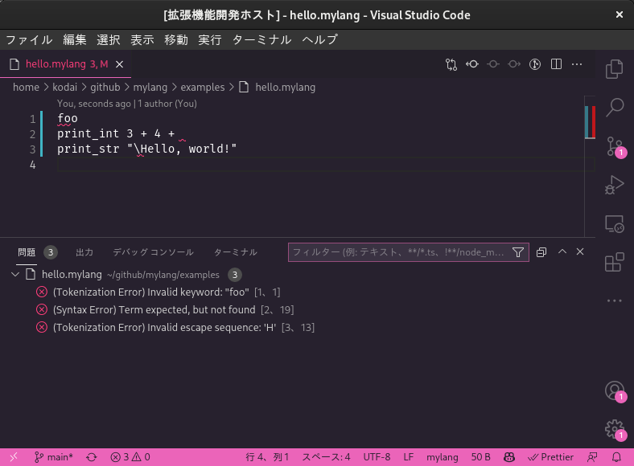
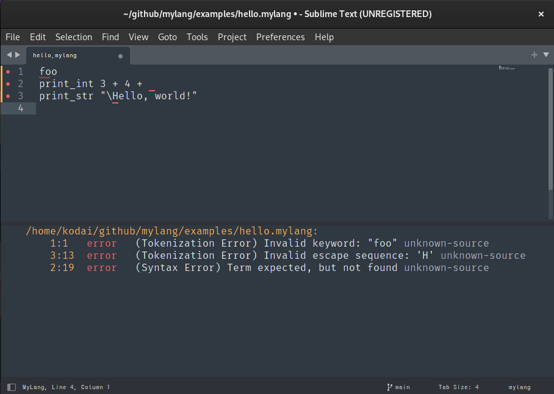

# mylang

[](https://github.com/0918nobita/mylang/actions/workflows/check.yml)

趣味で少しずつ作っている自作プログラミング言語処理系です。

## 実行方法

### AST を解釈実行する場合

```bash
cd examples
cargo run --bin lexer -- hello.mylang -o hello.tok.json
cargo run --bin parser -- hello.tok.json -o hello.ast.json
cargo run --bin ast_interp -- hello.ast.json
```

### AST をバイトコードに変換してから VM で実行する場合

```bash
cd examples
./hello
```

-----

## 言語サーバ実装・エディタ連携について

Rust で言語サーバを開発しており、これを各種エディタの言語クライアントと通信させることで共通の

- シンタックスハイライト
- 字句/構文解析エラーの表示機能

などを提供することを目指しています。

### (エディタ共通) 言語サーバのビルド・インストール方法

```bash
cargo build -p lsp_server
cargo install --path ./crates/lsp_server
```

### VS Code の場合



#### ビルド方法

```bash
cd vscode-ext
pnpm i
pnpm build
```

#### 起動方法

VS Code でこのリポジトリのルートディレクトリを開き、F5 または「実行 → デバッグを開始」で起動できます。

### Sublime Text 4 の場合



- Package Control で LSP パッケージをインストール
- 「`Tools` → `Developer` -> `New Syntax…`」を選択し、開いた右側のエディタの内容を以下のように編集し、ファイル名は `mylang.sublime-syntax` にして保存する

```yaml
%YAML 1.2
---
# See http://www.sublimetext.com/docs/syntax.html
file_extensions:
    - mylang
scope: source.mylang
contexts:
    main: []
```

- 「`Preferences` → `Package Settings` -> `LSP` -> `Settings`」を選択し、開いた右側のエディタの内容を以下のように編集して保存する

```json5
// Settings in here override those in "LSP/LSP.sublime-settings"
{
    "clients": {
        "MyLang": {
            "enabled": true,
            "command": ["lsp_server"],
            "selector": "source.mylang",
            "env": {
                "RUST_LOG": "info"
            }
        }
    }
}
```
